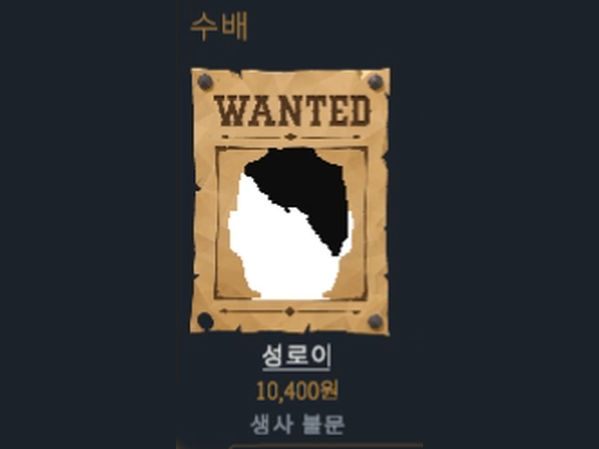
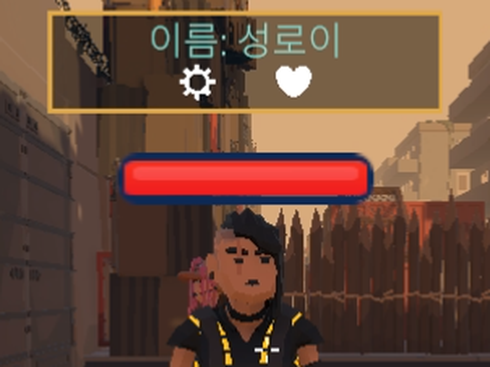
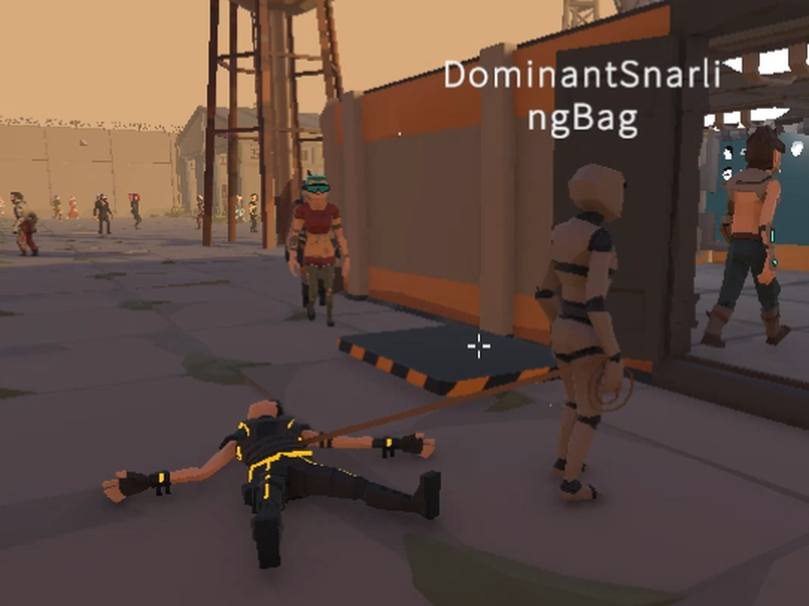
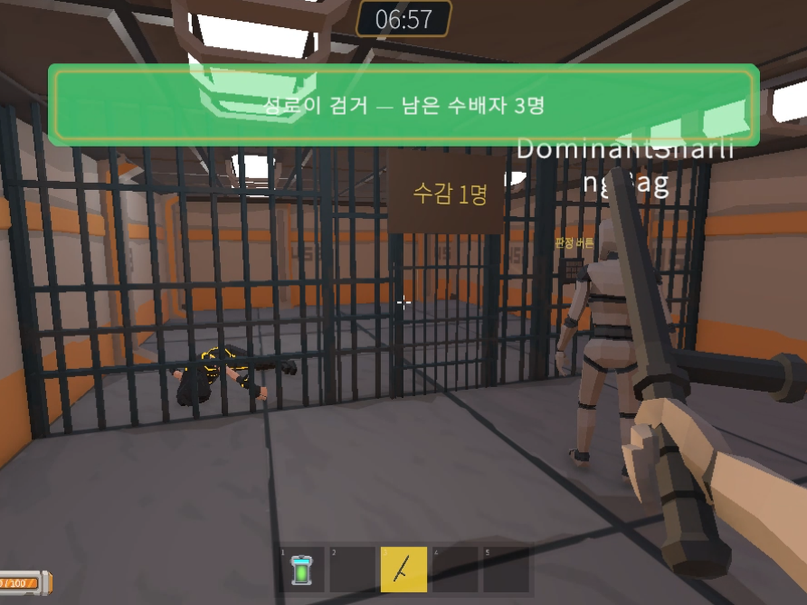
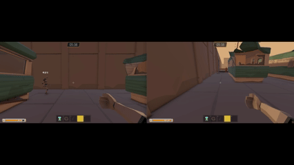
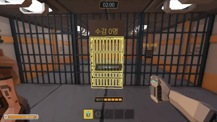
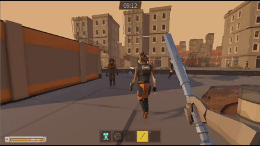
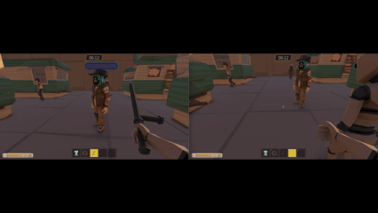
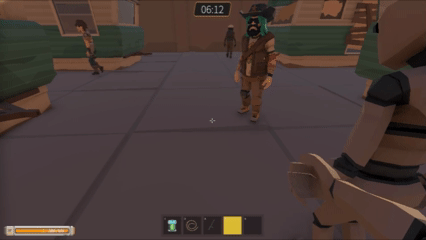

# 별점 1점 경찰서 (One-Star Precinct)

> 치안이 무너진 사이버펑크 근미래 도시, 예산이 바닥난 "별점 1점짜리" 경찰서의 로봇 경찰이 되어
> **수배서 한 장으로 시민 속 진범을 찾아** 제압하고 끌고 오는 **1인칭 협동 게임**.

| 항목 | 내용 |
|---|---|
| 장르 | 1인칭 협동 / 파티 게임 |
| 플랫폼 | PC · 온라인 협동 멀티플레이 (최대 6인) |
| 엔진 | Unity 6000.3.15f1 (URP) |
| 네트워크 | Unity Netcode for GameObjects 2.13 + Unity Gaming Services (Relay · Lobby · Vivox · Cloud Save) |
| 개발 기간 | 2026.07 ~ 진행 중 |
| 팀 | 4인 (와장창 특공대) |
| 레퍼런스 | Papers, Please · Lethal Company |
| 저장소 | 총 커밋 약 2,600개 · **본인 커밋 675개 (약 26%)** |

---

## 1. 게임 소개

### 핵심 루프

1. **준비** — 로비에서 아이템을 구매하고 이번 라운드 맵을 고른다.
2. **출동** — 역할은 고정이 아니다. **본부는 맵 위의 "위치"**이고, 그 자리에 선 사람이 본부 기능을 수행한다.
3. **수사 & 검거 (10분)** — 현장은 시민을 육안으로 관찰하고 스캐너로 속성 정보를 얻는다. 본부는 CCTV·미니맵으로 현장을 지켜보며 무전으로 상황을 공유하고, 검거한 범인의 탈옥을 막는다.
4. **정산** — 유치장에 넣은 대상의 현상금 합계로 목표 금액을 채우면 성공. 오검거 스탯도 함께 공개된다.

### 한 명을 잡기까지

|  |  |
|:--:|:--:|
|  |  |
| **① 수배서 확인** — 몽타주·현상금·생사 조건을 본다 | **② 용의자 식별** — 거리의 시민 중에서 대상을 특정한다 |
|  |  |
| **③ 제압 · 견인** — 쓰러뜨린 뒤 밧줄로 묶어 끌고 온다 | **④ 수감 · 검거** — 유치장에 넣으면 검거 확정 |

### 설계상의 재미

- **본부 상주의 트레이드오프** — 간헐적으로 터지는 해킹 이벤트가 발생하면 CCTV와 미니맵이 먹통이 되고, 복구는 본부에서만 할 수 있다. 또 검거해 둔 범인의 탈옥을 막기 위해 본부를 지키는 인원이 필요하다. 본부에 사람을 둘수록 현장이 비기 때문에 "지금 남을까, 나갈까"를 매 순간 고민하게 만든다.
- **매 판 다른 변수** — 정전·해킹·납치·폭탄·UFO 등 돌발 이벤트와 랜덤 용의자 구성이 같은 판을 두 번 만들지 않는다.

---

## 2. 아키텍처

코드 구조 규칙을 문서(`docs/architecture.md`)로 명문화하고, **PR 자동 리뷰가 그 문서를 기준으로 검사**하도록 묶어 두었다.

```
사용하는 쪽 컴포넌트 ──(App.그룹.매니저 로만 접근)──▶ App (전역 파사드)
                                                       ▲
매니저 ──(베이스 클래스 상속만 하면 Awake에서 자동 등록)──┘
```

- **App 파사드** — `App.Net` / `App.Game` / `App.UI` / `App.Sound` 로 전역 매니저 접근 경로를 하나로 모았다. `CommonManagerBase`·`NetworkedManagerBase`를 상속하면 `ManagerHandler`가 리플렉션으로 App에 자동 주입·해제한다. **새 싱글톤 금지.**
- **도메인 분리** — `Round · NPC · Player · HQ · Item · Interaction · Events · Network · Economy · Traffic` 을 도메인으로 두고, `Core·UI·Data·Common` 등 공유 계층과 구분한다. App 등재 기준은 "씬에 하나뿐인 서비스 **AND** 두 개 이상 도메인이 참조".
- **연출 전파 규칙** — 지속 상태는 `NetworkVariable`, 일회성 연출은 `App.Game.Fx.PlayEverywhere(EFx, 위치)` 한 줄로 통일. 아이템마다 전파 RPC를 따로 선언하지 않는다.
- **비동기 대기는 UniTask** — 코루틴 신규 작성 금지, `GetCancellationTokenOnDestroy()` 관례.
- **규칙 R1–R8 + 의도적 예외 표** — 예외는 사유와 이슈 번호를 적어야만 예외로 인정된다.

---

## 3. 내가 맡은 작업 (이현진)

> 담당 축: **플레이어 전반(1인칭 카메라 · 이동 · 애니메이션 · 상호작용)** 과 **래그돌(물리 사망 표현) 전반**, 그리고 **개발 인프라**.
> 멀티플레이 환경 구축과 세션은 팀원 담당이고, 본인의 네트워크 작업은 래그돌 동기화에 한정된다.
> 아래는 커밋·PR·설계 문서로 남아 있는 작업들이다.

### 3-1. 플레이어 — 1인칭 조작 · 이동 애니메이션 · 상호작용

> **주 담당.** 이용자가 직접 만지는 층 전체.

- **1인칭 카메라** — 시점·자세 제어를 `PlayerLook`으로 분리하고, 시점 갱신 뒤에 이동이 실행되도록 호출 순서를 고정했다.
- **이동 애니메이션 동기화 — 전송량을 0으로** — `MoveX`/`MoveZ`를 매 틱 보내는 대신, `NetworkTransform`이 이미 보내는 position의 **변화량을 각 피어가 로컬 좌표계 속도로 환산해 역산**하게 했다. 애니메이션 전용 전송량 **1.2 KB/s → 0 KB/s** (6인 접속 기준 7.2 KB/s → 0).
- **블렌드 트리** — 2D Freeform Directional, 정지 0 / 걷기 1 / 달리기 2. 속도를 반지름으로 정규화해 대각선 입력(0.7071 · 1.4142)에서도 같은 단계가 나오도록 맞췄다.
- **타격 타이밍 정렬** — 팔 루트 기준 4구간 스윙을 만들고, 1인칭·3인칭 모션과 서버 판정이 **같은 타이밍 소스**를 참조하게 했다.
- **상호작용 판정 — 수정 → 회귀 → 분리 (PR #431 / Issue #853)** — 두꺼운 벽 앞 NPC가 조준·타격되지 않던 문제를, 레이캐스트가 맞은 **위치** 대신 **Transform 간 거리**를 기준으로 판정하도록 바꿔 해결했다(#431). 약 4주 뒤 얇고 긴 벽처럼 피벗이 한쪽 끝 모서리에 있는 오브젝트에서 관통이 생기는 회귀가 드러나(#853), **대상 선정과 가림 판정을 분리**해 닫았다.
- **플레이어 상태(Down / Die)** — 공통 무력화 구조에 Die·부활 경로를 확장하고, 상태별 행동 제한과 복구 조건(일으키기·뒤집기, 부활 키트)을 구분했다.

|  |  |
|:--:|:--:|
|  |  |
| **이동 애니메이션 동기화** — 원격 플레이어의 걷기·달리기. 애니메이션 파라미터를 전혀 보내지 않고, 보는 쪽이 position 변화량으로 역산해 재생한다 | **상호작용 아웃라인** — 조준한 대상만 켜진다. 대상 선정과 가림 판정을 분리한 결과 |

### 3-2. 래그돌 시스템 — 플레이어·NPC 공용 리그 설계

`Assets/Scripts/Common/Ragdoll/` (11개 파일, 약 3,000줄) — **해당 폴더 커밋의 88%가 본인 작업.**

처음에는 NPC 전용이었고 사망 전용 모델이 따로 있었으나, 플레이어에도 같은 표현이 필요해지면서
**"살아있는 리그 한 벌로 무너진다"**는 구조로 통합했다. 그 결과 Player·NPC가 같은 코드를 공유한다.



*홈런 진압봉 — 데미지 대신 임펄스를 준다. 타격 → 비행 → 정착이 한 장면에 들어간다.*

| 파일 | 역할 |
|---|---|
| `RagdollRig` | 리그 조립·전환의 중심 |
| `RagdollPoseStreamer` | 뼈 자세 네트워크 스트리밍 (압축·시퀀스·신뢰 패킷) |
| `RagdollRope` | 밧줄에 끌리는 래그돌 — 관절 연결·다중 운반자 (밧줄 연행 기능 자체는 팀원 작업, 래그돌 적용이 본인 작업) |
| `RagdollSettlePolicy` | 정착(움직임 종료) 판정을 Player·NPC가 공유 |
| `RagdollArmFold` · `RagdollWallProbe` | 벽 끼임 탈출 |
| `RagdollBindPose` · `RagdollBoneGraph` · `RagdollSkins` | 리그 질의 책임 분리 (리팩터링으로 갈라냄) |

### 3-3. 래그돌 네트워크 동기화 — 대역폭과 소유권

> **공동 담당 중 본인 파트:** 권위 전환 · 쿼터니언 압축 · 전송 주기 분리.

|  |  |
|:--:|:--:|
|  |  |
| **클라이언트 A** | **같은 순간, 클라이언트 B** |

*호스트가 계산한 자세를 받아 양쪽이 같은 모양으로 무너지고 같은 자리에 정착한다.*

- **권위를 호스트로 통일** — 처음에는 골반 위치만 보내고 나머지 뼈는 각 클라이언트가 로컬 물리로 계산했는데, 전송받은 골반과 로컬에서 계산한 뼈가 계속 충돌했다. **호스트가 전 뼈를 물리로 계산해 자세를 내려보내고 클라이언트는 받은 자세를 따르기만 하도록** 설계를 되돌렸고, 그 대신 전송량 최적화가 과제로 남았다.
- **쿼터니언 압축 적용** — 뼈 회전을 smallest-three 방식으로 16B → 4B. 자세 한 벌(뼈 17개) **272B → 68B**, 패킷 전체 86B. 실측으로는 시체 1구당 **7.08 KB/s → 2.10 KB/s (−70.3%)**. NGO가 `NetworkTransform`에 쓰는 것과 **같은** `QuaternionCompressor`를 써서 양 끝의 구현 일치를 보장했고, 왜 4바이트에 들어가는지를 문서(`docs/quaternion-compression.md`)로 남겼다.
- **뼈 길이 전송 주기 분리** — 뼈 길이를 정착 시점에 한 번만 보내던 탓에 원격 클라이언트에 오차가 누적되다가 정착 순간 한 프레임에 반영되어 몸이 내려앉았다. 자세와 **채널을 분리해 뼈 길이만 2Hz로** 상시 전송, 정착 시 오차 1cm 미만. 뼈 길이 채널 **5.08 KB/s → 0.41 KB/s (−92.0%)**.
- **사망 중 소유권 서버 이관** — 쓰러진 몸의 권위를 Down 시점부터 서버로 옮기고, 이관 중에도 암전·무음·입력 차단이 유지되도록 `IsOwner` 감사표를 다시 작성했다.

### 3-4. 사망 · 검거 파이프라인

- **다운 유예 시스템** — 일반 피해는 다운 상태를 거치고, **차량·폭탄 피해는 유예를 건너뛰어 즉사** 후 래그돌로 날아가는 별도 진입점을 만들었다.
- **시체 유치장 반출** — 반출하면 정산에서 제외하고 재판정을 연다. 순간이동 시 클라이언트에서 바닥에 박히던 문제를 MPPM 실측으로 원인 확정 후 수정.
- **부활** — 부활 키트(동료 즉시 기상), 자가 부활(E 홀드).

### 3-5. 게임플레이 · 아이템 · UI

- **아이템** — 구역 스캔(반경 내 진범 유무를 링으로 표시), 거대 뿅망치(1% 확률 9999 즉사), 홈런 진압봉(데미지 대신 래그돌로 날림), 부활 키트.
- **아군 약탈** — 아이템이 아니라 쓰러진 동료에게 거는 상호작용. 소지품과 개인 자금을 탈취하고, 전용 HUD 패널을 따로 만들었다.
- **스캔 카드 개편** — 세력 텍스트 기반에서 **타입/생사 아이콘 구조**로 재설계, 체력바를 Slider 기반으로 바꿔 전 NPC에 동기화.
- **NPC 행동 보정** — 평소엔 도로를 건너지 않고 추격·도주에서만 건너도록, 도로에 남은 NPC는 인도 안쪽까지 걸어 나가도록 상태별 경로 규칙 추가.
- **오검거 페널티** — 발동을 끄고 집계만 남기는 스위치 구조로 정리하고 GDD에 반영.
- **라운드 밸런스·맵 배치·상점 진열**, 사이버펑크 맵 경계 및 스폰 조정 등 빌드 단위 조정.

### 3-6. App 파사드 · Localization (공동 담당)

- **App 공통 접근 경로 설계** — 2장의 파사드 구조 중 본인 파트. 매니저를 생성 시 App에 한 번 등록하고, 소비자는 인스펙터 연결이나 씬 검색 없이 App 프로퍼티로 현재 참조를 조회하도록 정리했다. 런타임 `FindFirstObjectByType` 기반 씬 검색을 **26곳 → 0곳** (남은 5곳은 초기화·워밍업 단계에서 1회만 수행). 새 컴포넌트가 참조 방식을 매번 고르지 않아도 된다는 점이 협업에서 실질적인 이득이었다.
- **Localization** — 아이템 이름·설명을 `LocalizedString`으로 전환하고 한·영 테이블과 선택 언어 저장을 연결. 슬롯은 `StringChanged`로 갱신하고, 동적 안내는 키·인자로 넘겨 **표시하는 시점의 언어**로 읽게 했다. `[LocalizedEnum]` 선언을 기준으로 키·로케일별 빈 값을 검사하고, 실행 중 누락 키도 경고하도록 검증을 붙였다.

### 3-7. 팀 개발 인프라 (저장소 전체 설정의 대부분을 담당)

`.github/` · `.claude/` 커밋 16개 중 **15개가 본인 작업.**

- **Claude PR 자동 리뷰 파이프라인** — PR이 열리면 GitHub Actions가 `.claude/skills/pr-review` 절차로 코드를 리뷰하고 코멘트를 게시한다. CI에는 Unity Editor가 없으므로 컴파일 검사를 정적 검사로 대체하고, 씬·에셋 파일은 읽지 않고 경로만 보고하도록 규칙을 정의했다.
- **아키텍처 규칙 문서화** — 위 2장의 R1–R8과 예외 표. 자동 리뷰가 이 문서를 기준으로 판정하므로, **규칙이 문서와 CI 양쪽에서 강제된다.**
- **이슈/PR 템플릿, CODEOWNERS 기반 리뷰어 자동 배정**, 기능 단위 이슈 + 체인 라벨 운영.
- **설계·인수인계 문서 문화** — 기능마다 `docs/<이슈번호>-<주제>.md` 로 설계 근거와 실측 결과를 남긴다. 현재 60여 편.

---

## 4. 기술적으로 깊이 판 문제

포트폴리오 관점에서 **원인 규명 과정이 남아 있는** 작업 세 건.

### (1) 래그돌이 슬로모션으로 쓰러지던 문제 — #759 / #763

- **증상** — 원격 클라이언트에서 시체가 실시간보다 느리게 무너졌다. 체감 문제라 "느리다"만으로는 진전이 없었다.
- **접근** — 먼저 **느림을 재는 지표**를 만들었다. 정착까지 걸린 시간, 끌리는 시체가 제자리에 머무는 구간, 피어별 운반 경로(밧줄/캡슐), 창마다 보낸 자세 바이트 수를 계측해 로그로 뽑았다.
- **원인** — 루트 추종이 물리 스텝이 아닌 프레임 갱신에 묶여 있었다.
- **해결** — 루트 추종을 물리 스텝에 묶어 제거. 수정 후 **빌드 실측으로 검증**하고, 추적 과정 전체를 인수인계 문서 3판으로 남겼다.
- **부수 효과** — 원인을 좇는 과정에서 사망 전용 모델을 걷어내고 리그를 한 벌로 통합하게 됐다 (3-1).

### (2) 래그돌 팔이 벽에 박히던 문제 — #980

- 벽과 겹친 채 정착한 몸의 팔이 벽 안으로 들어가 빠져나오지 못했다.
- 재현 단축키를 먼저 만들어 상황을 고정한 뒤, `RagdollWallProbe`로 벽을 감지하고 `RagdollArmFold`로 **팔을 몸쪽으로 접어 빼내는** 방식으로 처리. 회귀를 막기 위해 테스트로 못박았다.

### (3) 자세 스트리밍 대역폭 — #728

- 뼈 17개 × 회전을 매 창 보내면 무압축 272B. 압축 적용 후 68B(패킷 전체 86B).
- 압축 이후에도 **정착 낙차**(자세가 진입 자세로 덮이는 문제), **블렌드 중간 자세가 물리로 새는 문제**, 골반 복제 잔재 등을 순차적으로 걷어냈고, 뼈 길이는 신뢰 패킷에 따로 실어 보내도록 분리했다.

---

## 5. 저장소 구조

```
Assets/
  Scripts/
    Core/        App 파사드 · 매니저 자동 등록 · 씬 전환
    Common/      도메인 비소속 공유 부품 (Ragdoll)
    Player/      이동 · 시야 · 전투 · 호송 · 약탈 · 이모트 · 인벤토리
    NPC/         FSM · NavMesh · 외형 조합 · 스폰 · 프로필
    HQ/          CCTV · 미니맵 · 수배 리스트 · 유치장 · 제보 전화 · 원격 문
    Item/        스캐너 · 진압봉 · 테이저 · 도구 · 유치장 아이템
    Events/      정전 · 납치 · 폭탄 · UFO · 세력 · 계절
    Interaction/ 상호작용 · 검거 · 문 · 맵
    Network/     인증 · 세션 · 동기화 · 음성(Vivox)
    Economy/     팀 자금 · 상점 · 배달
    Round/ UI/ Data/ Traffic/ Tutorial/ Save/ Audio/ Vfx/ Localization/
  Scenes/        Title · Lobby · Shop · Tutorial · Maps(Apocalypse · Cyberpunk)
docs/            GDD · architecture · 기능별 설계/인수인계 문서 60여 편
.github/         이슈·PR 템플릿 · Claude PR 자동 리뷰 워크플로
.claude/         PR 리뷰 스킬 · 훅
```

---

## 6. 실행

```bash
git clone https://github.com/hyunjin0814/undercover-team4-project.git
```

1. **Unity 6000.3.15f1** 로 프로젝트를 연다.
2. 멀티플레이 테스트는 **Unity Multiplayer Play Mode(MPPM)** 를 사용한다.
3. Relay · Lobby · Vivox · Cloud Save 를 사용하므로, 온라인 세션을 띄우려면 **Unity Gaming Services 프로젝트 연결**이 필요하다.
4. 시작 씬은 `Assets/Scenes/Title Scene.unity`.

---

## 7. 주요 문서

| 문서 | 내용 |
|---|---|
| [`docs/GDD.md`](docs/GDD.md) | 게임 디자인 문서 — 게임 규칙의 정본 |
| [`docs/architecture.md`](docs/architecture.md) | 코드 구조 규칙 — PR 자동 리뷰의 판정 기준 |
| [`docs/quaternion-compression.md`](docs/quaternion-compression.md) | 회전 하나를 16B에서 4B로 |
| [`docs/728-ragdoll-pose-streaming.md`](docs/728-ragdoll-pose-streaming.md) | 래그돌 자세 스트리밍 설계 |
| [`docs/759-ragdoll-slowmotion-handoff.md`](docs/759-ragdoll-slowmotion-handoff.md) | 슬로모션 원인 규명 인수인계 |

---

## 8. 팀

| 담당 | 영역 |
|---|---|
| 이현진 (팀장) | 플레이어 전반(1인칭 카메라 · 이동 · 애니메이션 · 상호작용) · 래그돌 · 래그돌 네트워크 동기화 · 클라이언트 아키텍처 · 개발 인프라 |
| 김준영 | NPC AI (FSM · NavMesh · 상태 전이) · 돌발 이벤트 · NPC 애니메이션 |
| 김진아 | NPC 데이터 · UI · 세션 / 멀티플레이 환경 |
| 이현석 | 아이템 시스템 · 상점 · 맵 디자인 |
